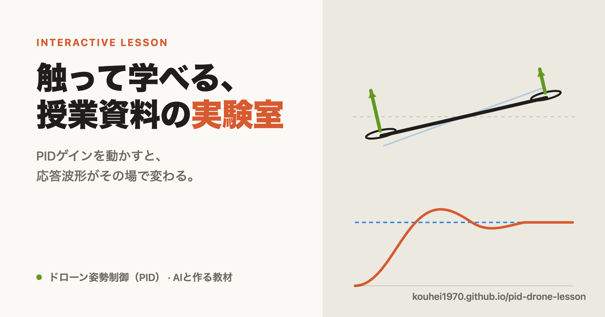

# インタラクティブ授業資料の実験室

教科書の内容を「読むだけ」でなく、**自分で値を動かして確かめられる**教材へ。
AIエージェントとの協業で作る、ブラウザだけで動くインタラクティブ授業資料のサンプル集です。



🔗 **公開ページ:** https://kouhei1970.github.io/pid-drone-lesson/

---

## なぜ作るのか（背景）

教科書をAIエージェントにスライド化させる検討を進めていました。しかし LaTeX/Beamer で
生成されるスライドは、どうしても単調で、ページをめくるだけの退屈なものになりがちです。

本当に学びを助けるのは、**読者が値を変え、結果が即座に返ってくる**教材だと考えています。
たとえば制御ゲインを動かすと応答波形がその場で変化する——そうした「手を動かす理解」を、
特別なソフトのインストールなしに、ブラウザだけで実現することを目指しています。

こうした教材を人が手作業で1つずつ作るのは作業量が膨大です。
**ここはAIとの協業が最も威力を発揮する領域**だと考え、その実証としてこのサンプルを公開しています。

---

## 収録教材

| 教材 | 分野 | 内容 |
|------|------|------|
| [正弦波の表現 — 複素数とオイラーの公式](lessons/sinusoid-complex/) | 電気回路Ⅱ（第8回） | 既存スライド・動画を使わず、**この資料だけで1コマの授業が完結**するインタラクティブ講義。**「解説（定義・回路図・式変形）→ 操作（確認）」の二段構成**で、各ページに 解説／図／操作 のバッジ付き。SVGで描き起こした回路図（抵抗のみ・LR）、実部/虚部の色分け定義、オイラーの公式の色分け導出などの解説ページと、複素平面のドラッグ・単位円の回転・極形式変換などの操作ページを交互に配置。年度可変のスケジュール、プロジェクタ向け1画面フィット（ビューポート連動のフォント拡大・全画面ボタン）にも対応。全32ページ＋練習4問・スライド直リンク対応（`#番号`）。 |
| [ドローン姿勢制御（PID）](lessons/drone-pid/) | 制御工学 | 1軸ロールのドローンを題材に、PID の3ゲイン（比例・積分・微分）をスライダーで調整し、目標角への応答・オーバーシュート・整定時間・外乱（突風）抑制をリアルタイムに観察。 |

今後、力学など他分野の教材も追加予定です。

> 「正弦波の表現」は、電気回路Ⅱ第8回の教科書スライド（LaTeX/PowerPoint）の内容を、**静的スライドを一切流用せず**にゼロからインタラクティブ教材へ作り変えた事例です。AIエージェントとの協業で、図・操作・解説・練習問題までを単一HTMLに実装しています。

### ドローン姿勢制御教材のモデル

1軸の剛体回転を扱います。

$$ J\ddot{\theta} = \tau - b\dot{\theta} $$

- $\theta$：ロール角 [deg]、$J$：慣性モーメント、$b$：粘性係数
- 制御則は微分項を計測値側にとった PID（積分アンチワインドアップ付き）:

$$ \tau = K_p\,e + K_i\!\int e\,dt - K_d\,\dot{\theta}, \qquad e = \theta_{ref} - \theta $$

スライダーで $K_p, K_i, K_d$ を変えると、応答波形・各指標がその場で更新されます。

---

## 構成

```
.
├── index.html              入口（索引）ページ — 構想の説明と教材一覧
├── lessons/
│   └── drone-pid/
│       └── index.html      ドローンPID教材（単一ファイルで自己完結）
├── README.md
├── LICENSE                 MIT
└── .nojekyll               GitHub Pages に HTML をそのまま配信させる印
```

各教材は **外部ライブラリに依存しない単一HTMLファイル**です。`<canvas>` への素の
JavaScript 描画のみで構成しているため、ファイルをダブルクリックするだけでオフラインでも動きます。

---

## ローカルで開く

ビルド不要です。リポジトリを取得して、HTMLをブラウザで開くだけです。

```bash
git clone https://github.com/kouhei1970/pid-drone-lesson.git
cd pid-drone-lesson
open index.html          # macOS（Windows は start、Linux は xdg-open）
```

---

## どう作られているか

これらの教材は、AIエージェント（Claude Code）との対話で設計・実装しています。
題材（物理モデル・制御則）と教育上の狙いを人間が与え、可視化・UI・数値積分の実装と
調整をAIが担う、という協業のかたちを試しています。

---

## ライセンス

[MIT License](LICENSE) — 教育目的での再利用・改変を歓迎します。
